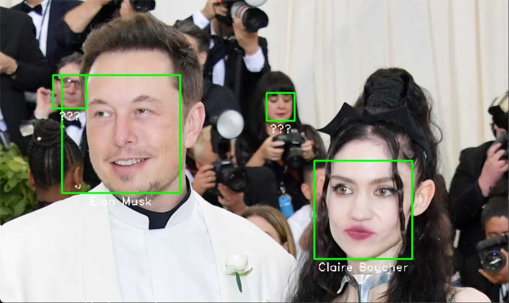

# Desafio de Projeto: Reconhecimento Facial

Este é um projeto desenvolvido como parte do desafio da Formação Machine Learning Specialist, oferecida pela Digital Innovation One (DIO).

## Sobre o Projeto

O projeto consiste em um sistema simples de reconhecimento facial em Python, utilizando as bibliotecas OpenCV e face_recognition. O objetivo é inserir e identificar rostos em imagens, exibindo caixas delimitadoras ao redor dos rostos identificados.

## Funcionalidades

- Inserção de rostos em um banco de dados
- Reconhecimento de rostos em imagens de entrada
- Exibição de caixas delimitadoras nos rostos identificados

## Exemplo de Saída

## Como Usar

1. Abra o arquivo `rec_facial.ipynb` em um ambiente Jupyter Notebook.
2. Siga as instruções e execute as células conforme necessário.

## Referências

- [Digital Innovation One](https://digitalinnovation.one/)

Esse projeto foi concluído como parte do desafio proposto pela Formação Machine Learning Specialist da DIO.